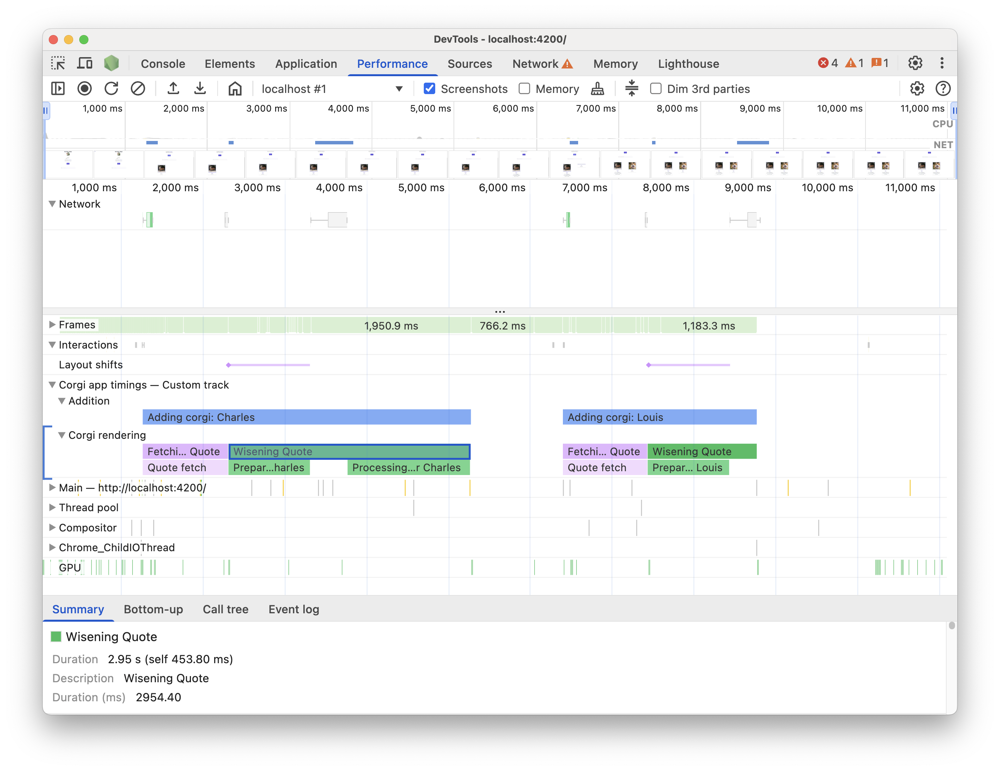

# Corgi Collage

This is a basic Angular app that exemplifies the ability to extend the
Chrome DevTools Performance Panel using the [API based on User Timings](https://developer.chrome.com/docs/devtools/performance/extension). 
In this example, the format is used to add custom tracks to the
timeline.

## Extension data

In this example, the code triggers arbitrary tasks that are run when the
button is clicked. The tasks are measured and registered to the browser
and for each measurement, a name, description, color and track are included
to customize the way and place the measurements will be
displayed in the Performance Panel timeline.

The tasks are run and measured in the [corgi component](./src/app//corgi/corgi.component.ts) in
the `injectTimingsToBrowser` function.

## Try it

Clone this repo and run `yarn install && yarn start`.

Or try the live version available at https://corgi-collage.vercel.app/.

You need to run a Chrome version equal to or higher than 128.

*_Note: to trigger the measured tasks you need to add a corgi to the collage
using the "Add new Corgi" button._*

## Example

